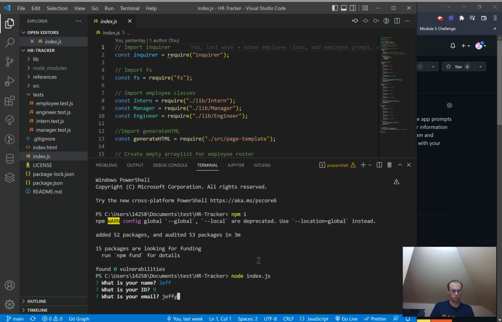

    # HR-Tracker

  

  ## Table of Contents

  [Author](#author)  
  [Contact](#contact-me)  
  [Deployed Page](#deployed-page)  
  [GitHub Repo](#github-repo)  
  [Project Description](#project-description) 
  [Video Walkthrough](#video-walkthrough) 
  [Installation](#installation) 
  [Usage](#usage) 
  [Test Instructions](#testing) 
  [Contribution Guidelines](#contribution) 
  [Preview Image](#preview-image) 
  [Questions](#questions) 
 

  ## Author

  Alex Mayberry

  ### Contact me

  **Github:** [alexmayberry](https://github.io/alexmayberry)

  **Email:** alexclimbs@gmail.com

  **Website:** https://alexmayberry.github.io/dev-portfolio/

  ## Deployed Page
  
  N/A

  ## GitHub Repo

  [HR-Tracker](https://github.io/alexmayberry/HR-Tracker)

  ## Project Description

  This command line interface app prompts you (as a manager) to enter information about yourself and your team and renders an HTML webpage with your team information.

  ## Video Walkthrough

  
   
  Also see the [video](https://drive.google.com/file/d/18OP9irlBgBGir-6NOyEn_6DKNvaVeDkF/view) demonstrating how to run and test the app.

  ## Installation

  Clone down a copy of the app from the repo, open it in your text editor, and use npm to install the node dependancies to run the app.

  ## Usage

  Once dependancies are installed, run the app by typing `node index.js` in a terminal open to the root project directory. Then, simply answer the questions in the terminal and open the index.html file that is rendered.

  ## Testing

  to test the app, open an integrated terminal in the `tests` directory and type `npm run test`. Jest will run and the results will be displayed.

  ## Contribution

  Jump in! A good next step would be to create different style sheets render the team pages in different styles.

  ## Questions

  please reachout via email, twitter or github.

  